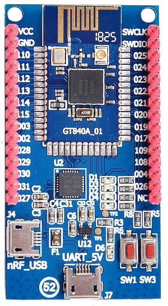

# Patch manual
This repository has original files from the BLE Sniffer project by Nordic Semiconductor. [Link](https://www.nordicsemi.com/Software-and-tools/Development-Tools/nRF-Sniffer-for-Bluetooth-LE/) to the webpage. 
This project is really cool but it has only loadable HEXes for Nordic Semi development boards so you can't easily port it to every board with Nordic Semi MCU.

## Why I created this repo and put this project without any changes?
I use a BLE in my project so I try to get as more debug information as possible. And I decided to buy a powerful and cheap board for sniffing BLE traffic. This board isn't a development board from Nordic but _mostly_ it's compliant with the board [nRF52840 DK](https://www.nordicsemi.com/Software-and-tools/Development-Kits/nRF52840-DK) (PCA10056 in Nordic format). The main differences: 
- there is no onboard debugger;
- there is no reset pin/button (don't know why developers decided to do so);
- only two user buttons;
- cheap USB-UART bridge IC CP2102 by Silicon Labs;

So the last point is the reason why I created this patch. The original project default baudrate for UART is 1Mbaud but CP2102 IC maximum speed is 921600 baud. So It's impossible to get any useful data from this custom board because when Nordic python addon tries to open serial port with 1Mbaud the real speed will be 921600 baud and all data will be corrupted.
It's quite funny because API that is used between board and python script has a method that can change (reduce) baudrate but still you need to perform a first call somehow.

## What was changed in this project?
Almost nothing. I investigated that the firmware is used a UARTE0. This module has a register _BAUDRATE_ where firmware loads a new value. I didn't check a reference manual how to calculate this value (I think it's some sort of the divider/multiplier value for UART module clock) but SDK by Nordic has some precalculated values. So I understood that the value for 1Mbaud is _0x10000000_. With Segger J-Link debugger I found out that the value is copied from RAM with start address _0x20000240_ (+ 3 bytes because it's a 32bit value). But before loading from RAM somebody should init this value and this value must be in a flash memory, right? Yes and no. Yes it's loaded from flash address _0x5315_ but only the MSB value that is _0x10_ another three bytes are cleared with _0x00_. It's quite interesting because I think it's happened due to compiler optimization procedure. So we can change only MSB and thanks to all electronics gods because value _0x0F000000_ is compliant for BAUDRATE register and it equals to 921600 baud. So that's it. You need to change value at this address in the HEX file (the addresses are aligned so HEX _0x5315_ value is that you need) and recalculate hex check byte (it's just inversed sum of bytes for current line and we decrement byte by 1 the check byte will be incremented by 1). For this firmware version it'll be _0x80_ instead of _0x7F_ or you can check it with this [wiki link](https://en.wikipedia.org/wiki/Intel_HEX).
The last step that we should do is to change python script. You need to change script ___extcap/SnifferAPI/UART.py___ and add extra value to the list of values for _SNIFFER_BAUDRATES_. So the final value will be something like this:
```python
SNIFFER_BAUDRATES = [921600, 1000000, 460800]
```

Note. This step isn't mandatory because as I saw in Linux driver and also checked manually in Windows the driver setups a maximum baudrate for the CP2102 IC if the value is bigger than the maximum value that is 921600 baud.

## For which boards this manual is compliant?
First of all for boards that are compliant (at least UART pinout) with nRF52840 DK (PCA10056) and they have this cheap UART-USB bridge IC. This firmware is only compliant with nRF52840 MCU. 

### Information 
This manual is provided without any gurantee and author isn't responsible for steps you do.

### Extra
I've got a picture of my board by seller. 


And also a link to a [seller](https://aliexpress.ru/item/32919832696.html).